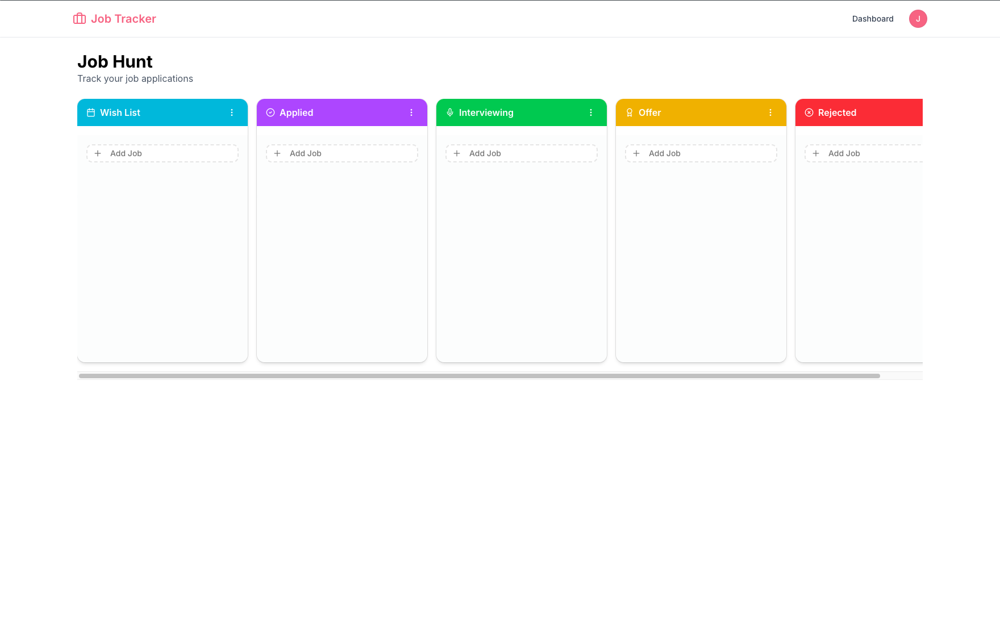
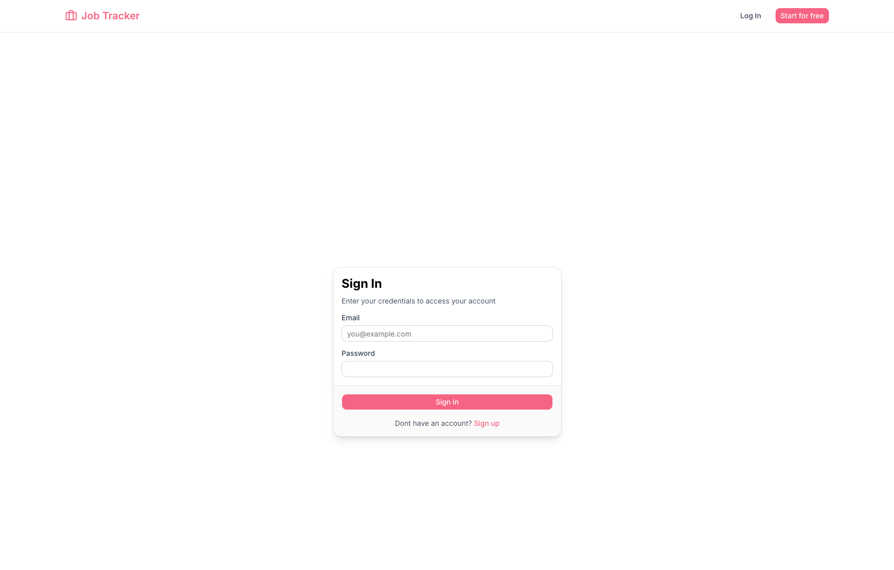
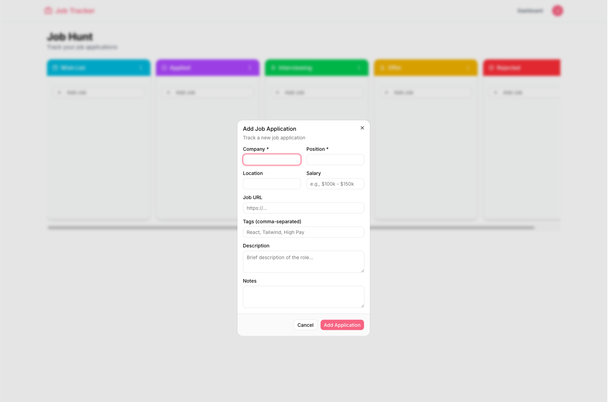
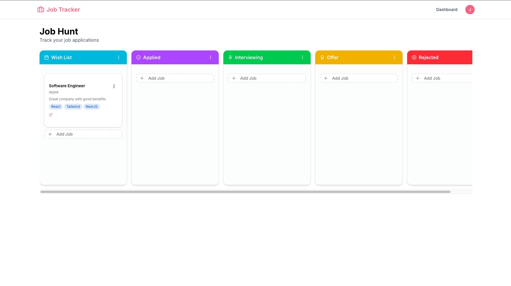
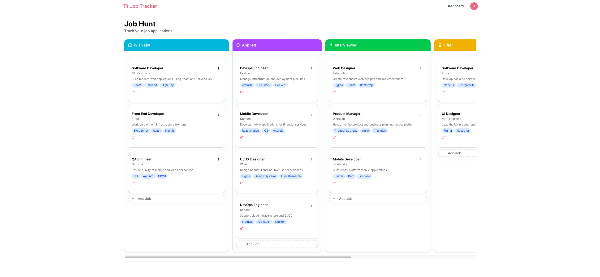

# Job Application Tracker - Study Project

A modern, full-stack job application tracking system built with Next.js, featuring a drag-and-drop Kanban board interface to help you organize and manage your job search process.



## Features

- **Kanban Board Interface**: Visual drag-and-drop board to track job applications across different stages
- **User Authentication**: Secure login/signup with Better Auth
- **Real-time Updates**: Instant UI updates with Next.js server actions
- **Responsive Design**: Works seamlessly on desktop and mobile devices
- **Data Persistence**: MongoDB integration with Mongoose ODM
- **Modern UI**: Built with Shadcn/ui components and Tailwind CSS

## Tech Stack

- **Frontend**: Next.js 16, React 19, TypeScript
- **Styling**: Tailwind CSS, Shadcn/ui
- **Database**: MongoDB with Mongoose
- **Authentication**: Better Auth
- **Drag & Drop**: @dnd-kit/core and @dnd-kit/sortable
- **Deployment**: Ready for Vercel/Netlify

## Screenshots

### Login and Register


### Create a Job Application


### Keep Track and Update the status of the Job Application


### Dashboard Insights


## Getting Started

### Prerequisites

- Node.js 18+
- MongoDB database (local or cloud like MongoDB Atlas)
- npm, yarn, pnpm, or bun

### Installation

1. Clone the repository:
```bash
git clone https://github.com/yourusername/job-application-tracker.git
cd job-application-tracker
```

2. Install dependencies:
```bash
npm install
```

3. Set up environment variables:
Create a `.env.local` file in the root directory:
```env
MONGODB_URI=your_mongodb_connection_string
NEXTAUTH_SECRET=your_secret_key
NEXTAUTH_URL=http://localhost:3000
```

4. Run the development server:
```bash
npm run dev
```

5. Open [http://localhost:3000](http://localhost:3000) in your browser.

### Database Setup

The app will automatically create the necessary collections and initialize a default board with columns when a user signs up.

### Seed Data

A seed script is available at `scripts/seed.ts` to populate the database with sample boards, columns, and job applications for a test user.

> Note: This script is written in TypeScript. Run it using a TypeScript runner such as `ts-node`, or compile it first before executing.

Example command:
```bash
npm run seed:jobs
```

If you want to seed a specific user, update the `USER_ID` constant inside `scripts/seed.ts` before running it.

## Usage

1. **Sign Up/Login**: Create an account or log in to access your dashboard
2. **View Dashboard**: See your job applications organized in a Kanban board
3. **Add Applications**: Click "Add Job" to create new job application cards
4. **Move Applications**: Drag and drop cards between columns to update status
5. **Edit Details**: Click on any job card to view/edit full details
6. **Delete Applications**: Use the menu on each card to remove applications

## Project Structure

```
├── app/                    # Next.js app directory
│   ├── api/               # API routes
│   ├── dashboard/         # Main dashboard page
│   └── auth/              # Authentication pages
├── components/            # React components
│   ├── ui/               # Shadcn/ui components
│   └── kanban-board.tsx  # Main board component
├── lib/                   # Utility libraries
│   ├── actions/          # Server actions
│   ├── auth/             # Authentication config
│   ├── db.ts             # Database connection
│   └── models/           # Mongoose models
├── scripts/               # Utility scripts
│   └── seed.ts            # Sample data seeding script
└── public/               # Static assets
```

## API Reference

### Job Applications

- `createJobApplication(data)` - Create a new job application
- `updateJobApplication(id, updates)` - Update an existing application
- `deleteJobApplication(id)` - Delete an application

### Authentication

Uses Better Auth for secure authentication with support for multiple providers.